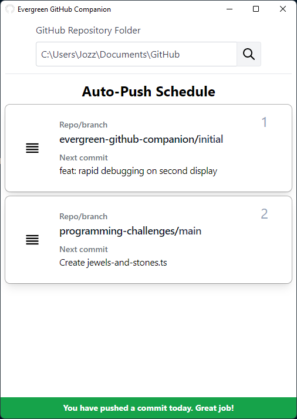

# evergreen-github-companion

#### 🔴Project abandoned when I discovered all of the [criteria](https://docs.github.com/en/account-and-profile/setting-up-and-managing-your-github-profile/managing-contribution-graphs-on-your-profile/why-are-my-contributions-not-showing-up-on-my-profile) a commit must meet to appear within the GitHub profile activity graph. Basically, non-primary branch commits (PRs or otherwise) don't count, and, in my use case, it doesn't make sense to go for a commit onto main for each day.

Helps you keep your GitHub profile green (and not through illegitimate means).



This is a desktop application that scans local git repositories for unpushed commits. If you have not pushed a commit to GitHub today and there is an unpushed commit available, it will set the date on the commit to today, and then push it to GitHub.

Let's say you only have one day a week to make commits. You can make seven meaningful commits, and the program will push one of them a day to GitHub. At the end of the week, your activity graph on your GitHub will be solid green at one commit a day.

## Why?

Some folks like to motivate themselves to do something by maintaining a "streak". In this case, that can be daily activity on GitHub, or more specifically, at least one commit a day. However, one might be too busy on a particular day or just might not have any ideas that day. This lets you "maintain" that streak as long as you put in the equivalent effort by front-loading multiple commits.

## Running the program

```bash
npm i
npm run build
npm run start
```
